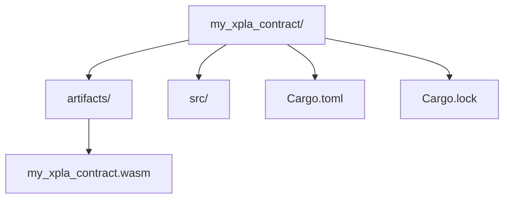

# 🚀 XPLA Smart Contract Deployment Guide

[](https://github.com/kongali1720/xpla-contract-tutorial)
[](https://github.com/kongali1720/xpla-contract-tutorial)
[](LICENSE)
[](https://xpla.io)

---

## 📌 Overview

Dokumentasi ini menjelaskan langkah demi langkah **cara membangun, compile, dan deploy smart contract CosmWasm** di **XPLA Cube Testnet** menggunakan Rust, Cargo, dan `xplad` CLI.  

---

## ⚙️ Prerequisites

1. **Install Rust**  
```bash
rustup update
rustup target add wasm32-unknown-unknown
```

2. **Cargo-Contract**
```bash
cargo install cargo-contract --locked
```

3. **XPLA CLI**
```bash
git clone https://github.com/xpladev/xpla
cd xpla
cargo build --release
```

4. **Wallet Setup (Testnet)**
```bash
xplad keys add mytestwallet
```

5. **Check Balance**
```bash
xplad query bank balances $(xplad keys show mytestwallet -a) --node https://cube-rpc.xpla.dev --chain-id cube_47-5
```

🏗️ Build Smart Contract

Masuk ke folder project smart contract:
```bash
cd my_xpla_contract
```
1. **Masuk ke folder project smart contract:**
```bash
cd my_xpla_contract
```

2. **Compile WASM:**
```bash
cargo contract build --release
```

3. **Optimize WASM (optional):**
```bash
wasm-opt -Os target/wasm32-unknown-unknown/release/my_xpla_contract.wasm -o artifacts/my_xpla_contract.wasm
```

☁️ Deploy to Cube Testnet
```bash
xplad tx wasm store ../my_xpla_contract/artifacts/my_xpla_contract.wasm \
  --from mytestwallet \
  --gas 2000000 \
  --fees 600000000000000000axpla \
  --node https://cube-rpc.xpla.dev \
  --chain-id cube_47-5 \
  -y
```

**Expected Result**
```markfile
txhash: <TXHASH_HERE>
```

🔍 Query Transaction
```bash
xplad query tx <TXHASH_HERE> --node https://cube-rpc.xpla.dev
```

⚠️ Common Errors & Fixes
| Error Message                        | Cause                               | Fix                                                                |
| ------------------------------------ | ----------------------------------- | ------------------------------------------------------------------ |
| `insufficient fee`                   | Fee set too low for the transaction | Increase `--fees` value                                            |
| `bulk memory support is not enabled` | WASM not optimized or incompatible  | Optimize WASM using `wasm-opt`                                     |
| `no such command: wasm`              | `cargo wasm` not installed          | Install `cargo-contract` (`cargo install cargo-contract --locked`) |

📌 Notes

* Pastikan wallet memiliki cukup saldo untuk membayar fees.
* Gunakan node RPC yang aktif agar query dan deploy berhasil.

## 📎 References

- [XPLA Documentation](https://xpla.io)
- [CosmWasm Documentation](https://docs.cosmwasm.com)
- [Cargo Contract GitHub](https://github.com/CosmWasm/cargo-contract)

📂 Folder Structure

## 🗂 Project Structure



```bash
my_xpla_contract/
├─ artifacts/
│  └─ (compiled .wasm file akan masuk sini)
├─ src/
│  └─ lib.rs
├─ examples/
│  └─ deploy.sh
├─ Cargo.toml
├─ Cargo.lock
├─ README.md
├─ LICENSE
├─ CONTRIBUTING.md
└─ .gitignore
```

**✅ Langkah Compile & Deploy**
```bash
# Masuk folder project
cd my_xpla_contract

# Compile smart contract
cargo contract build --release

# Optimize WASM (opsional tapi disarankan)
wasm-opt -Os target/wasm32-unknown-unknown/release/my_xpla_contract.wasm -o artifacts/my_xpla_contract.wasm

# Deploy
bash examples/deploy.sh
```

<div align="center">

## ✅ Gaspol Coding Squad Indonesia! 🚀💻
> Belajar sambil praktek langsung.<br>
> Run it, understand it.<br>
> Mini project Python yang gak bikin ngantuk!  
</div>

---

<div align="center">

## ☕ Traktir Kopi & Nasi Padang  

<strong>Dukung terus biar semangat bikin karya edukatif lainnya...</strong><br>
💡 ☕ <a href="https://www.paypal.com/paypalme/bungtempong99" target="_blank">Buy Me a Coffee via PayPal</a>

</div>

---

<div align="center">

## ❤️ INITIATING HUMANITY MODE... for Down Syndrome

<table align="center">
  <tr><th>Target</th><td>Anak-anak Pejuang Down Syndrome</td></tr>
  <tr><th>Status</th><td>Butuh Dukungan</td></tr>
  <tr><th>Aksi</th><td>Buka Hati + Klik Link = Senyum Baru</td></tr>
</table>

<p><em>Mereka bukan berbeda. Mereka hadir untuk mengajarkan kita arti cinta sejati dan kesabaran.</em></p>

<a href="https://mydonation4ds.github.io/" target="_blank">
  
</a>

</div>

---

<div align="center">

## 💳 Dukungan Pembayaran DONASI

<p>
  
  &nbsp;&nbsp;
  
  &nbsp;&nbsp;
  
</p>

</div>

---

<div align="center">

Kalau project ini bermanfaat, kasih ⭐ ya dan share ke temen-temenmu!<br>
Follow <a href="https://twitter.com/kongali1720" target="_blank">@kongali1720</a> buat update seru lainnya 🔥  

<a href="https://twitter.com/kongali1720" target="_blank">
  
</a>

</div>


